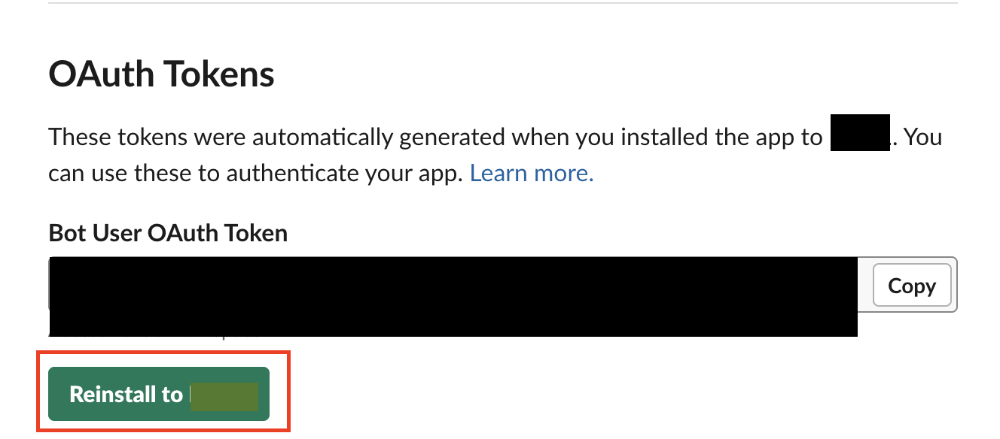

Voraussetzungen
- Slack
- AWS Account

=== Wir erstellen eine Lambdafunktion (die komplizierte Variante) ===
Diese Lambdafunktion wird eine Nachricht an einen bestimmten Slack-Channel senden: #beispielchannel (ID: Channel-ID)

Dafür brauchen wir einen Bot User OAuth Token und die Channel-ID

=== Bot User OAuth Token ===

Dafür gehst du auf https://api.slack.com/apps
- create New App(from scratch)
- verbinden mit Workspace (hast du mehrere Workspaces im Slack, den gewünschten auswählen)
- nach der Erstellung links in dem Reiter unter Features, auf OAuth & Permissions gehen
- runterscrollen zu Scopes
- Unter Bot Token Scopes fügen Regeln hinzu, was der Bot darf
- füge hinzu:
        - channels:join(damit der Bot dem Channel beitreten darf)
        - chat:write(damit der Bot etwas im Chat schreiben darf)
- hochscrollen zu OAuth Tokens und auf Installations Button drücken
- über dem Button, findest du dann den Bot User OAuth Token

- erstelle im Slack in deinem Workspace einen neuen Channel
- Im Workspace unter Channels auf Channel hinzufügen
- Gehe in den Channel hinein
-> dann oben rechts auf die drei Punkte
-> Channel-Details öffnen
-> ganz unten steht dann die Channel-ID, sogar mit Copy-Button (notfalls etwas nach unten scrollen)

==== in Version 2.0: Slack-Daten in in terraform.tfvars einfügen  und deoply starten ====

- öffne den File terraform.tfvars:
    function_name    = "dein Name"          # kannst du selbst wählen
    slack_bot_token  = "dein Token"         # hier deinen Bot_Token einfügen
    slack_channel_id = "deine Channel-ID"   # hier die CHannel-ID einfügen
    region = "deine Region"                 # AWS-Region eintragen in der deployed werden soll
    lambda_timeout = 10                     # kann angepasst werden
    lambda_memory  = 128                    # kann angepasst werden

- wenn das erledigt ist, im Terminal die deploy.sh starten
- nutze dafür ./deploy.sh
- der File initiallisiert Terraform (terraform init), führt den plan und den apply aus (terraform plan, terraform apply) 
- Die Lambda wird automatisch erstellt und es wird eine automatisierte Testnachricjht an den Channel geschickt.

==== invoke nutzen um Nachrichten zu senden ====

- möchtest du dann über den Bot Nachrichten senden, nutze diesen Befehl:

aws lambda invoke \
  --function-name dein Name \
  --region deine Region \
  --payload '{"text":"Hallo #testlambda, ich komme aus Lambda 🚀"}' \ Text kann angepasst werden.
  --cli-binary-format raw-in-base64-out \
  out.json && cat out.json

